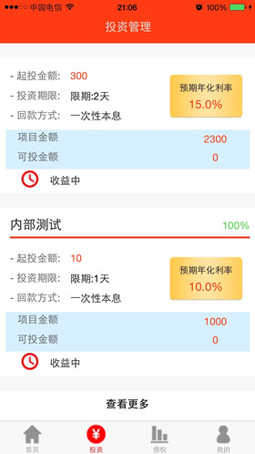

# ToLoan   
一款有关投资理财的App，是本人做的一个外包项目。主要工作是：按照已开发的安卓版复制出iOS版本（其中服务器由PHP编写，采用http通信方式）。   

### app截图   

> 
>       
> 
>       
> 
>    
> 
>    

### 项目总结
严格上来说，该项目是自己从事iOS开发以来所做的第一款真正意义上的app，虽然只是初版，但仍然带给我很多的收获，了解了一款app从最初构思到开发出来需要经历的各个阶段，学会了制定工作计划，积累了iOS开发经验，并锻炼了自己阅读项目文档及与人沟通的能力。